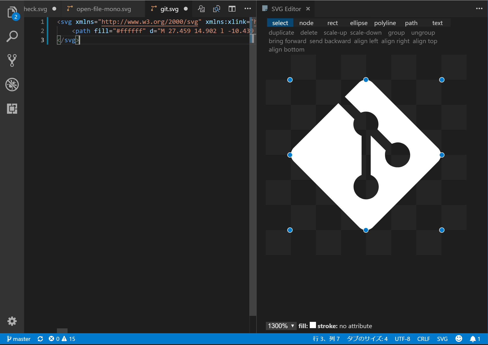

# SVG Editor

**ver 2.0**: Complete code rewrite😫 Support transform attribute, unit (em, cm, %, etc.), and more🎉

Now your VSCode can mutate to an interactive visual & literal SVG editor😎

You can create shapes using the SVG's coder or directly creating shapes with the shaping tool.

## Commands

- New File with SVG Editor
  - Open untitled file with SVG template.
- Open SVG Editor
  - Target active SVG file to edit with SVG Editor.
- Reopen Related TextEditor
  - Reopen files from SVG Editor tab.

## Configuration

- svgeditor.filenameExtension
  - Initial filename extension of new untitled file.
  - default: svg
- svgeditor.showAll
  - Send all attributes and tags to WebView regardless of SVG Editor support.
  - default: true
- svgeditor.defaultUnit
  - Specifies the unit when creating some shapes.
  - default: null
- svgeditor.decimalPlaces
  - The number of decimal places.
  - default: 1
- svgeditor.collectTransformMatrix
  - Collect two or more transform functions into a matrix.
  - default: true

## Current support tags and attributes

- svg: xmlns, xmlns:xlink, version, viewBox, x, y, width, height
- circle: cx, cy, r, `<presentation attributes>`
- rect: x, y, width, height, rx, ry, `<presentation attributes>`
- ellipse: cx, cy, rx, ry, `<presentation attributes>`
- polyline/polygon: points, `<presentation attributes>`
- path: d, `<presentation attributes>`
- text: x, y, dx, dy, textLength, lengthAdjust, `<presentation attributes>`
- g: `<presentation attributes>`
- linearGradient: `<presentation attributes>`
- stop: offset, stop-color, `<presentation attributes>`

`<presentation attributes>`: fill, stroke, transform, font-family, font-size, font-style, font-weight

## Future plans

- [ ] Embedded CSS
- [ ] Gradation colors
- [ ] Filters
- [ ] Images

## License

MIT
